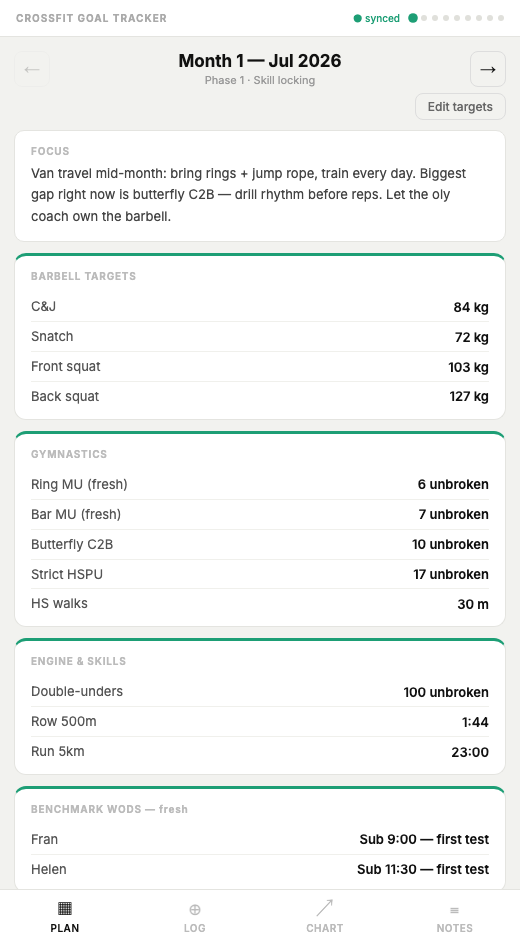
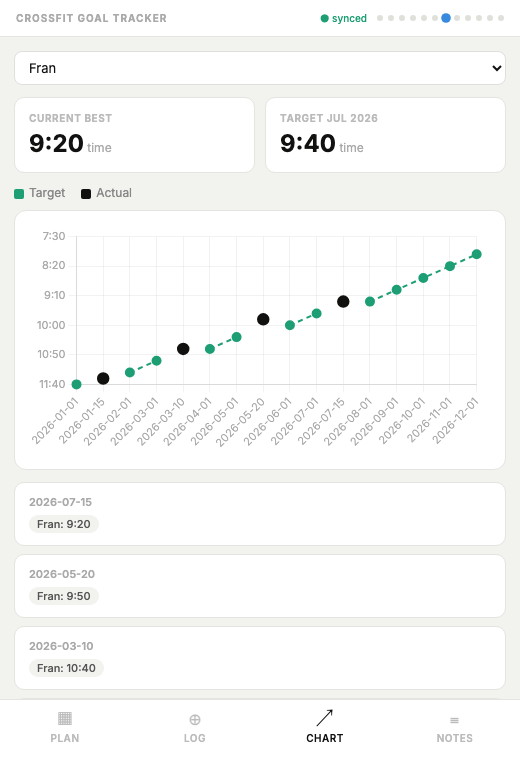

# crossfit-app

A goal-based CrossFit training tracker: set a timeframe and your starting numbers, get a month-by-month plan toward Rx-level targets, log training against it, watch the gap close.



## The problem, and who it's for

I wanted one place to hold a training plan and check real numbers against it, instead of a plan sitting in Notes and PRs scattered across old workout logs. It's basically my own prep plan for the 2027 CrossFit Open, then I generalized it: anyone working toward Rx level can set how long they've got (6 months to 3 years) and where they're starting from, and get a plan that ramps toward a standard Rx target instead of a guess.

## What works today

- **Goal-based plan generator** — pick a duration, enter current numbers per metric (barbell 1RMs, gymnastics skills, engine benchmarks, five classic WODs), get a month-by-month target ramp toward a fixed Rx-level goal.
- **A real example plan**, loadable as-is — the actual 9-month periodized plan I built for my own 2027 Open prep, personal notes included.
- **Training log** — dated entries per metric, freeform session notes.
- **Progress view** — target vs. actual charted over time (Chart.js), per metric.
- **Per-month editing** — override any generated target or display text by hand; reset falls back to the generated value, not a blank slate.
- **Offline-first, opt-in sync** — data always lives in the browser first; syncing to the self-hosted backend is opt-in per browser (see below), so trying the live demo never touches anyone else's data.



## What I did myself

I designed the data model — plan generation, per-month overrides, and logged history kept as separate concerns so overrides survive plan regeneration — the interpolation/clamping rules for the goal ramp, and the deploy setup (nginx + systemd + Let's Encrypt via one idempotent script). I also made the scope call: single-tenant per deployment instead of building real accounts, since that would have added real complexity for no signal in a portfolio piece. I used Claude Code to implement against that spec once the design was settled (see [Provenance](#provenance-ai-assisted-development-and-license) below), and tested every flow myself in a real browser before accepting it.

## Architecture

- **Frontend:** a single static `index.html` — vanilla JS/CSS, no framework, no build step. [Chart.js](https://www.chartjs.org/) via CDN for the progress chart.
- **Backend:** `server.py`, a ~40-line Flask API that persists whatever JSON blob it's given (`logs`, `notes`, `plan: {setup, overrides}`) to a single file.
- **Deploy:** nginx as reverse proxy + static file server, systemd for the Flask process, Let's Encrypt for TLS — all provisioned by `setup.sh` on a fresh Debian/Ubuntu VPS.

| File | Role |
|---|---|
| `index.html` | Entire frontend — UI, plan generator, sync logic |
| `server.py` | Flask API: `GET/POST /api/data`, `/api/ping` |
| `setup.sh` | End-to-end VPS provisioning (deps, files, API key, nginx, systemd, SSL) |
| `crossfit.nginx.conf` | nginx site config (static + reverse proxy to Flask) |
| `crossfit-tracker.service` | systemd unit for the Flask API |

### How the plan generator works

- Every metric has a fixed goal value representing a solid Rx-level standard.
- If you enter a starting number for a metric, each month's target is linearly interpolated from your start toward that goal, landing on it exactly in the final month; metrics you're already past the goal on are clamped flat instead of ramping backward.
- Metrics left blank simply don't get a target — still loggable and chartable, just without a target line.

## Controls, error handling, human approval

- **Backend sync is opt-in per browser**, off by default. Visiting `?sync=on` once flips it on and it's remembered from then on (`?sync=off` flips it back); with it off, everything — onboarding, a generated plan, logs, notes — stays in that browser's `localStorage` and never reaches the backend. This is what makes it safe to point the live demo at anyone: a curious visitor building a test plan can't overwrite my real data, because their browser never writes to the shared file unless they deliberately opt in.
- Auth on top of that is a single shared-secret header (`X-Key`), generated randomly by `setup.sh` and injected into both frontend and backend at deploy time — never committed to git.
- Destructive actions (deleting a note, resetting a month's targets, changing plan setup) all go through a `confirm()` prompt first.
- Network failures don't lose data: writes are cached to `localStorage` before the sync attempt (when sync is on), and the UI shows real sync state (`synced` / `saving` / `offline` / `error` / `local only`) instead of failing silently.
- Input parsing is defensive but not paranoid — invalid numbers/times just resolve to `null` (no target, no log value) instead of throwing.

## Try it

```bash
pip install flask
python3 server.py             # serves the API on :3847
python3 -m http.server 8000   # serve index.html, or just open it directly in a browser
```

`server.py` and `index.html` both ship with the same `CF_SECRET_KEY_PLACEHOLDER` — replace it with any matching string in both files to authenticate locally. First load with no synced plan yet shows onboarding: "Load example" (my real 2027 Open prep plan) or "Build my plan" (your own numbers + timeframe).

By default nothing talks to the API — open `index.html?sync=on` to exercise the backend sync path against your local `server.py`.

To deploy: `./setup.sh`, run as root on a fresh VPS. Installs nginx/certbot/Flask, copies the app to `/var/www/crossfit`, generates a random API key and injects it into both frontend and backend, configures nginx + systemd, and requests a Let's Encrypt certificate.

## Limits, and what's public vs. private

- **Single-tenant, one shared file when sync is on.** There's no real multi-user backend — if two different browsers both opt into sync, they read and write the same file, last write wins. Opt-in sync (see Controls above) keeps this from being a problem for casual visitors, but it's not a substitute for real accounts if more than one person ever needs sync at once.
- **Whole-file writes, no history.** Every synced save overwrites the entire data file; there's no conflict resolution for concurrent multi-device writes and no versioning of past saves.
- **Rx goal numbers are generic defaults**, not adjusted for bodyweight, gender, or category — a reasonable starting point, editable per month once a plan exists.
- **Upgrading an existing deployment:** the synced data shape changed when the generator was added (`plan.setup` + `plan.overrides` instead of a flat object); redeploying over an older instance drops back to onboarding — logs and notes carry over untouched, only the plan needs to be re-set or reloaded from the example.
- The deployment domain (`crossfit.lpconsultings.com`, in `crossfit.nginx.conf`) is my own personal domain — no third-party or client work anywhere in this repo.

## Provenance, AI-assisted development, and license

Built solo, using Claude Code as a pair-programming tool for implementation once I'd made the product and architecture decisions myself — the data model, interpolation rules, deploy setup, and scope calls are mine; AI accelerated writing and refactoring the code against that spec, and I reviewed and tested every change, including in a real browser, before accepting it.

MIT — see [LICENSE](LICENSE).
